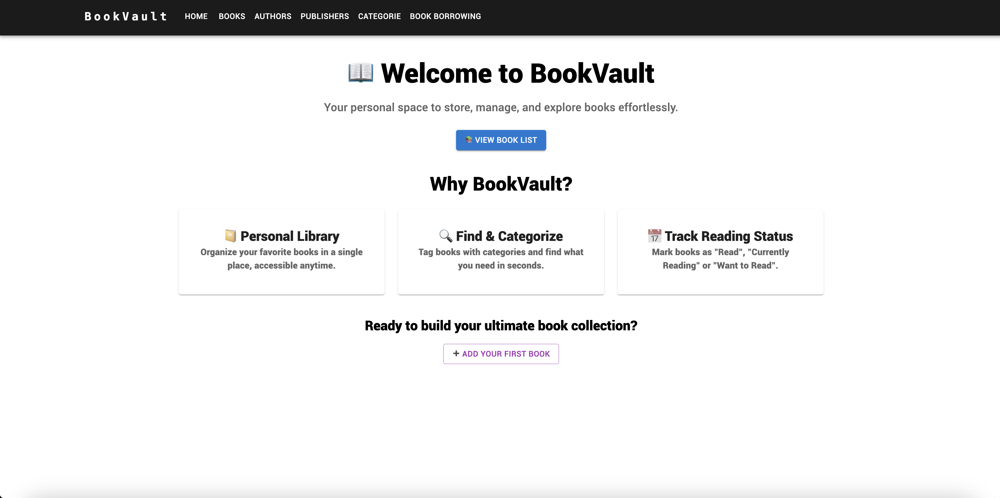

# Library App
A simple library management web application built with React and Material UI. This app provides an intuitive UI to manage books, authors, publishers, categories, and borrowing records.

## Features
- **Responsive Navigation**: A header component with a responsive menu for easy navigation.
- **CRUD Operations**: Manage library data through Create, Read, Update, and Delete operations.
- **Backend Integration**: Communicates with a Java Spring Boot backend API for data persistence.

## 🖥️ Live Demo

[Check out the live demo]() 🚀


## Technologies Used
- **React**: For building the user interface.
- **Material UI**: For responsive and modern UI components.
- **Axios**: For HTTP requests to the backend.
- **Java Spring Boot**: Backend framework (API).
- **Vite**: For fast development and build process.

## Installation

### Prerequisites
- Node.js (npm or yarn)
- A running Java Spring Boot backend API
- Git

### Steps

1. **Clone the Repository**
   ```bash
   git clone https://github.com/ergytalha/Library-App.git
2. **Navigate to the Project Directory**
    cd your-repo

3. **Install Dependencies**
    npm install
    or 
    yarn install
4. **Configure Environment Variables**
Create a `.env` file in the root directory and add your backend API URL.
5. **Run the Project**
    npm run dev
    or
    yarn dev

## Project Structure
Library-App/
├── src/
│   ├── components/
│   │   └── Header.jsx         # Navigation header component
│   ├── pages/
│   │   ├── Books.jsx          # Books management page
│   │   ├── Authors.jsx        # Authors management page
│   │   ├── Publishers.jsx     # Publishers management page
│   │   ├── Categories.jsx     # Categories management page
│   │   └── Borrowing.jsx      # Borrowing records page
│   └── App.jsx                # Main application component
├── public/
│   └── index.html             # Main HTML file
├── .env                       # Environment variables
├── package.json               # Project metadata and dependencies
└── README.md                  # This documentation
## Usage
Use the navigation header to move between different sections of the app. Each section lets you perform CRUD operations on the corresponding library data.
